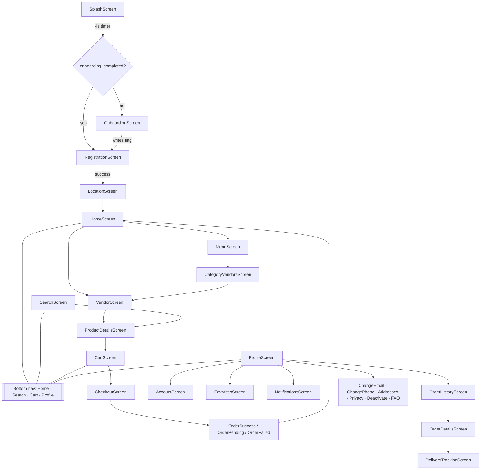
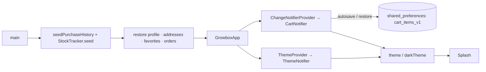
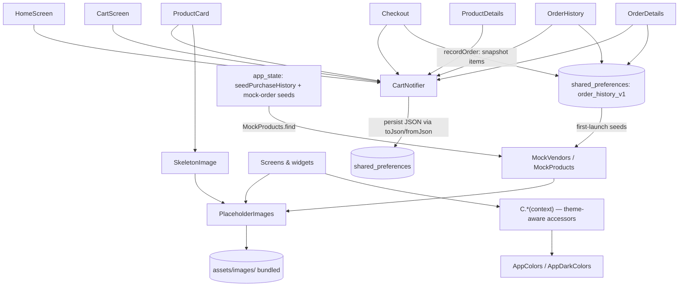

# GROWBOX — Architecture

GROWBOX is a Flutter (Material 3) grocery-delivery app for consumers. There is no
backend: the catalog, cart, and orders live in in-memory mock data, and every
image is a bundled asset, so the app runs fully offline. It shares branding and
design language with the vendor app in a sibling project (`growbox_vendor`).

---

## 1. Folder structure

```
lib/
├── main.dart                     # Entry point: seeds mock data, restores persisted state, wires providers + MaterialApp
├── routes.dart                   # AppRoutes: named-route table + push helpers
├── theme.dart                    # Entire design system: colors, text, spacing, sizing, ThemeProvider
├── data/
│   ├── mock_data.dart            # Models + canonical catalog (MockVendors / MockProducts.find), CustomerData, JSON codecs
│   ├── app_state.dart            # CartNotifier, order store (StoredOrder/OrderItem), addresses/favorites, seeders + persistence
│   └── placeholder_images.dart   # Single source of truth for every image asset path
├── screens/                      # One file per screen (28 screens) — see §6
├── widgets/                      # Reusable widgets & micro-interactions — see §7
└── services/
    └── voice_search_service.dart # Parses speech-to-text into structured VoiceIntent commands

assets/
├── images/                       # All bundled images (product photos, banners, brand logos)
└── icon/launcher.png             # App launcher icon

test/
├── widget_test.dart              # Smoke test (splash logo asset)
└── registration_navigation_test.dart  # Regression test: Continue-with-Email PageView bug
```

---

## 2. App startup & entry flow

```
main()
 ├─ seedPurchaseHistory()          # mock "Buy Again" history (canonical catalog instances)
 ├─ StockTracker.seed()            # mock stock levels
 ├─ restore persisted user data    # profile / addresses / favorites / orders (shared_preferences)
 ├─ SystemChrome UI overlay style
 └─ runApp(GrowboxApp)

GrowboxApp (stateful)
 ├─ ThemeNotifier (ValueNotifier<ThemeMode>)  → ThemeProvider (InheritedNotifier)
 └─ ChangeNotifierProvider(CartNotifier)
    └─ MaterialApp
       ├─ theme / darkTheme        # built in main.dart (Google Fonts, seed color, transitions)
       ├─ routes: AppRoutes.routes
       └─ home: SplashScreen

SplashScreen (4s branded animation)
 └─ reads shared_preferences flag `onboarding_completed`
    ├─ false → OnboardingScreen (3-slide intro; sets flag when done)
    └─ true  → RegistrationScreen (5-step wizard)
               └─ on success → LocationScreen → HomeScreen
```

---

## 3. Theme system (`lib/theme.dart` + `main.dart`)

The design system lives in one file, `theme.dart`:

| Symbol            | Role |
|-------------------|------|
| `AppColors`       | Light-theme palette (constants). `primary` = dark green `#1C4815`. |
| `AppDarkColors`   | Dark-theme palette. Brighter greens (`primaryDark` `#3EC930`) so brand color stays visible on dark surfaces. |
| `C`               | **Context accessor — the preferred way to color anything.** `C.surface(context)`, `C.textPrimary(context)`, `C.divider(context)`, `C.isDark(context)`, … Each returns the dark variant automatically. |
| `AppNeumorphic`   | Neumorphic shadow helpers. |
| `AppTypography`   | Shared text styles. **Caveat:** several are hardcoded to light-theme colors — pair them with `.copyWith(color: C.xxx(context))` when used in dark mode. |
| `AppSpacing` / `AppRadii` | Spacing and radius constants. |
| `AppDecorations`  | Reusable `InputDecoration`, button styles (incl. `primaryButtonStyle()`). |
| `AppSizing`       | Responsive helpers derived from `MediaQuery` (e.g. `logoAreaHeight`, `welcomeFontSize`). |
| `formatPrice()`   | Formats Naira prices (`₦`). |
| `ThemeProvider` / `ThemeNotifier` | Light/dark/system switch. `ProfileScreen` renders the `_DarkModeToggle` switch that calls `themeNotifier.toggle()`. |

**How themes are built (`main.dart`):** both light and dark `ThemeData`
derive from `ColorScheme.fromSeed(seedColor: AppColors.primary)`, and their
text themes come from `GoogleFonts.interTextTheme(...)` with Poppins for
headlines/buttons. The text theme is based on a brightness-correct
`ThemeData(...).textTheme` base — this was a deliberate fix so dark-mode
`TextField` input/hints inherit light text instead of the default (black).

**Conventions:**
- Always use `C.*(context)` accessors instead of raw `AppColors` where the
  surface can be either theme.
- Exception: brand entry screens (splash, registration banner) intentionally
  paint constant `AppColors.primary` in **both** themes — so the white-art
  logo is always correct there and no theme flip applies (see comments in
  `splash_screen.dart` / `registration_screen.dart`).
- White Google button and black Apple button use fixed brand colors on purpose.

---

## 4. State management

There is no backend, database, or state library beyond `provider` — state is a
mix of a root `ChangeNotifier`, inherited notifiers, and per-screen state.

- **`CartNotifier`** (`data/app_state.dart`) — cart: add / remove /
  `removeOne` (quantity decrement) / `clear`, `items`, `total`, `length`.
  Quantity is expressed as duplicate entries, so `VendorProduct` implements
  value equality (by serialized form). Every mutation **autosaves** to
  `shared_preferences` (`cart_items_v1`) and a fresh notifier **restores** the
  cart on startup — items survive app restarts. Provided once at the root and
  consumed with `context.watch` in the cart, product details, home, order
  screens, `ProductCard`, and the cart badge.
- **`ThemeNotifier`** (`theme.dart`) — `ValueNotifier<ThemeMode>`, exposed via
  `ThemeProvider` (an `InheritedNotifier`).
- **Canonical catalog** — `MockVendors.vendors` in `mock_data.dart` is the
  single source of truth for every product; `MockProducts.all` flattens it
  and `MockProducts.find(name:, vendorName:)` resolves canonical instances.
  Anything that needs "the same product the storefront shows" (Buy Again,
  mock-order seeds) resolves through it instead of building duplicate
  `VendorProduct` copies that could drift out of sync.
- **Static mock data** — `seedPurchaseHistory()` seeds the home "Buy Again"
  row from canonical catalog instances; `StockTracker.seed()` populates
  stock levels at startup.
- **Persistence** — via `shared_preferences`, user data survives restarts
  under `*_v1` JSON keys: cart (`cart_items_v1`), saved addresses
  (`delivery_addresses_v1`), favorite vendors (`favorite_vendors_v1`),
  profile (`customer_profile_v1`), and order history (`order_history_v1`).
  Mutations write through automatically and `main()` restores everything
  before the first frame. Corrupt/unreadable payloads fall back to the
  in-memory default (empty cart, seeded address/orders) rather than crashing.
- **Order snapshots** — an order is an immutable `StoredOrder` of
  `OrderItem`s; each line **freezes price and image at purchase time**
  (`recordOrder()` at checkout), so a later catalog price/image change never
  rewrites a past order. The first-launch mock seeds snapshot the canonical
  catalog via `MockProducts.find`. Order History and Order Details render
  only from this store.
- **Per-screen state** — most screens are `StatefulWidget`s with controllers
  (e.g. the 5-step registration wizard keeps its own `PageController`,
  step index, and collected fields).

---

## 5. Image pipeline

**Every image in the app flows through one file: `data/placeholder_images.dart`.**
Getters return asset paths; the `_asset(name)` helper expands to
`assets/images/<name>.jpg`. The whole `assets/images/` folder is registered in
`pubspec.yaml`, so files bundle with the app — there is **zero network
dependency at runtime**.

- **Rendering:** screens use `Image.asset(...)` directly with `errorBuilder`
  fallbacks, or `SkeletonImage` (`widgets/skeleton_loader.dart`) which shows a
  shimmer placeholder while loading and a fallback icon on error. `SkeletonImage`
  also still supports network URLs (it branches on `http`) for future backend use.
- **Placeholders vs branding:** the getters are organized into sections —
  product photos, vendor covers & logos, and a clearly separated **BRANDING**
  section with the official assets:
  - `growboxLogo` — white-art logo (white planter + orange "Growbox") for dark
    surfaces (splash/registration green banners, dark theme).
  - `growboxLogoLight` — dark-art variant for light surfaces (login in light mode).
  - `googleLogo` — official Google "G".
- **Theme-aware logo selection:** done at call sites via
  `Theme.of(context).brightness` (see `login_screen.dart`); splash and
  registration skip it because their green banners are theme-invariant.
- **Dead-getter hygiene:** asset getters with no consumers are pruned (the
  old category-icon, promo-banner, map, and misc-photo sections were removed
  once `MenuAssets` and the produce-basket placeholder lost their screens), so
  an asset path can never silently rot behind an unused getter.

---

## 6. Navigation flow

**Named routes** (`routes.dart`, `AppRoutes`) — 16 registered routes:
`home, search, cart, profile, menu, location, account, favorites, notifications,
orderHistory, changeEmail, changePhone, privacy, deactivate, addresses, faq`.
Helpers: `AppRoutes.push(...)` and `AppRoutes.pushReplaceAll(...)`.

**Ad-hoc navigation** uses `Navigator.push(MaterialPageRoute(...))` in the auth
flow (registration ↔ login, registration → location) and the shopping flow.

**Page transitions** — default app-wide `SlideFadeTransitionsBuilder` for every
platform (`widgets/page_transitions.dart`); `widgets/page_transition.dart`
provides extra `SlideRoute` / `FadeRoute` / `ScaleRoute` builders for ad-hoc use.

**Main flow:**

```
Splash ──► Onboarding (first run) ──► Registration (5-step wizard)
            └────────► Location ──► Home
                                        │  bottom nav: Home · Search · Cart · Profile
Home ──► Vendor ──► Product Details ──► Cart ──► Checkout
Checkout ──► Order Success / Pending / Failed ──► Home

Profile ──► Account ──► Change Email / Change Phone / Addresses / Privacy / Deactivate / FAQ
Profile ──► Order History ──► Order Details ──► Delivery Tracking
Profile ──► Favorites · Notifications
```

`ScaffoldWithNav` (`widgets/scaffold_with_nav.dart`) wraps tab screens with the
4-tab `BottomNav` (Home, Search, Cart with live badge, Profile).

---

## 7. Screen map (`lib/screens/`)

| File | Responsibility |
|------|----------------|
| `splash_screen.dart` | Branded splash: animated logo glow; after 4s routes to onboarding (first run) or registration. |
| `onboarding_screen.dart` | 3-slide intro on first launch; persists the `onboarding_completed` flag. |
| `registration_screen.dart` | 5-step wizard (welcome → email → password → name → email confirmation) with step dots and a PageView. |
| `login_screen.dart` | Email/password sign-in with Google (official G logo) / Apple buttons; theme-aware brand logo header. |
| `forgot_password_screen.dart` | Multi-step password reset flow. |
| `location_screen.dart` | Map-based delivery-address picker (google_maps_flutter) with search and map FABs. |
| `home_screen.dart` | Shopping feed: promo banners, categories, Buy Again, deals, product grid. |
| `search_screen.dart` | Product search with suggestions and the voice-search overlay. |
| `menu_screen.dart` | Category & vendor directory. |
| `category_vendors_screen.dart` | Vendor list for a chosen category. |
| `vendor_screen.dart` | Vendor page: cover, product list, follow action. |
| `product_details_screen.dart` | Product detail, quantity stepper, add-to-cart, related products. |
| `cart_screen.dart` | Cart contents from `CartNotifier`, quantity edits, proceeds to checkout. |
| `checkout_screen.dart` | Delivery address + payment summary; places the order. |
| `order_success_screen.dart` | Order confirmation after checkout. |
| `order_result_screens.dart` | `OrderPendingScreen` / `OrderFailedScreen` status pages. |
| `order_history_screen.dart` | Past orders with filter tabs and reorder. |
| `order_details_screen.dart` | Single order detail: items and status. |
| `delivery_tracking_screen.dart` | Simulated live tracking: delivery stages, rider, animated map painters. |
| `favorites_screen.dart` | Saved/wishlist products. |
| `profile_screen.dart` | User profile, account menu, dark-mode toggle. |
| `account_screen.dart` | Account summary + action list (email, phone, addresses, privacy…). |
| `change_email_screen.dart` | Update email address flow. |
| `change_phone_screen.dart` | Update phone number flow. |
| `address_management_screen.dart` | CRUD for saved delivery addresses. |
| `privacy_screen.dart` | Privacy toggles (data sharing, cookies…). |
| `deactivation_screen.dart` | Account deactivation flow. |
| `faq_screen.dart` | Expandable FAQ list. |
| `notifications_screen.dart` | Notification list. |

## 8. Widget map (`lib/widgets/`)

| File | Responsibility |
|------|----------------|
| `bottom_nav.dart` | 4-tab bottom navigation with active indicator and cart badge. |
| `scaffold_with_nav.dart` | Shared scaffold that wraps tab screens with the bottom nav. |
| `product_card.dart` | Product tile: image, name, price, add-to-cart button. |
| `add_to_cart_animation.dart` | Fly-to-cart overlay, `AddToCartButton`, `CartBadge`, `CartKeyRegistry`. |
| `skeleton_loader.dart` | Shimmer skeletons + `SkeletonImage` (asset/network with loading & error fallbacks). |
| `animated_entrance.dart` | `AnimatedEntrance` (staggered fade/slide-in) and `TapScale`. |
| `micro_interactions.dart` | `TapFeedback`, `SkeletonBox/Circle/TextLines`, `AnimatedIconTap`. |
| `section_header.dart` | Reusable section title header. |
| `page_transition.dart` | Ad-hoc `SlideRoute` / `FadeRoute` / `ScaleRoute` builders. |
| `page_transitions.dart` | `SlideFadeTransitionsBuilder` — the app-wide default transition. |
| `voice_search_overlay.dart` | Voice-listening overlay with animated wave painter. |

## 9. Services & data

| File | Responsibility |
|------|----------------|
| `services/voice_search_service.dart` | Parses speech-to-text transcripts into `VoiceIntent` (`VoiceAction`: search / add-to-cart / remove-from-cart / navigate / unknown; `ParsedQuantity`; product lookup). |
| `data/mock_data.dart` | Data models (`VendorProduct`, `ProductBundle`, `CustomerData`) with JSON codecs + value equality, and the canonical catalog: `MockVendors.vendors` (storefront data) + `MockProducts.find` (canonical lookups). |
| `data/app_state.dart` | `CartNotifier`; order store (`StoredOrder`/`OrderItem` + `restoreOrders`/`persistOrders`/`recordOrder`); `DeliveryAddress` + address persistence; favorite-vendor persistence; `PurchaseRecord`/`seedPurchaseHistory()`; `TimeSuggestion`; `StockStatus`; `StockTracker`. |
| `data/placeholder_images.dart` | Every image asset path, organized into placeholder vs branding sections. |

**Where each screen gets its data:**

| Screen / feature | Data source |
|------------------|-------------|
| Storefront grids, vendor pages, product details, search, menu/category lists | `MockVendors` canonical catalog (`VendorProduct` instances) |
| Home "Buy Again" row | `seedPurchaseHistory()` — `PurchaseRecord`s holding canonical catalog instances |
| Cart contents, quantities, badge, checkout totals | `CartNotifier` (persisted `cart_items_v1`) |
| Order History list + Order Details | `storedOrders` store (`StoredOrder` snapshots; persisted `order_history_v1`) |
| Reorder | Snapshots frozen on the `StoredOrder`'s `OrderItem`s |
| Favorites (menu / vendor / favorites screens) | Favorite-vendor store (persisted `favorite_vendors_v1`) |
| Delivery addresses (checkout, account → addresses) | `DeliveryAddress` store (persisted `delivery_addresses_v1`) |
| Profile fields (registration, change email / phone) | `CustomerData` (persisted `customer_profile_v1`) |
| Every product / vendor image | `PlaceholderImages` getters → bundled `assets/images/` |

---

## 10. Dependencies (`pubspec.yaml`)

| Package | Used for |
|---------|----------|
| `provider` | `CartNotifier` / theme wiring. |
| `google_fonts` | Inter (body) + Poppins (headlines/buttons) text themes. |
| `shared_preferences` | Onboarding-completed flag + persisted cart (`cart_items_v1`). |
| `google_maps_flutter` | Location picker and delivery-tracking maps. |
| `speech_to_text` | Voice search. |
| `cupertino_icons` | iOS-style icons. |

---

## 11. Conventions worth knowing

- Color anything that can be either theme with `C.*(context)`, not raw `AppColors`.
- Text styles from `AppTypography` are light-theme-colored by default — add
  `.copyWith(color: C.xxx(context))` when used in dark mode.
- All images go through `PlaceholderImages`; never hardcode an asset path in a
  screen.
- Brand entry screens (splash, registration banner) are green in both themes —
  white-art logo always; do not "fix" them with a brightness swap.
- Conditional children in a `Stack` need stable `ValueKey`s so inserting one
  child doesn't recreate siblings (regression: registration back-button used to
  reset the PageView mid-animation — see `test/registration_navigation_test.dart`).
- Never hand-build a second copy of data that already lives in the catalog —
  resolve it with `MockProducts.find(name:, vendorName:)`. Past orders are the
  exception: their line items snapshot price/image at purchase time on purpose.

---

## 12. Diagrams (Mermaid)

### Navigation flow



### Startup & root providers



### Data & widget dependencies

